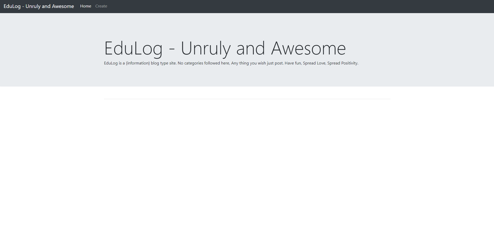

# EduLog
  * edulog is blog type app. where we can create an article and post it. 
  
# Future for Edulog
  * improving UI/UX
  * user verification
  * editable background
  * customised categories
  
# Stack Used : 
   * Frontend - Html, Css, Javascript.
   * Backend - Javascript, Firebase.
   * Hosted In - Netlify.
   
# Screenshots of the project ⬇️

# Live demo :
  * link - https://laughing-payne-b3bf30.netlify.app/
